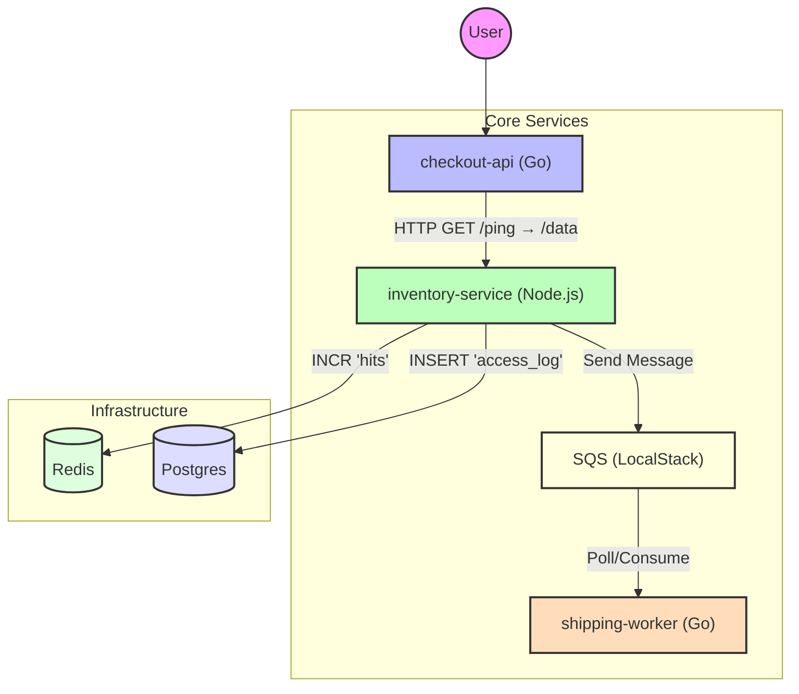

# Obs Demo Stack

A comprehensive demonstration of an observability stack (LGTM: Loki, Grafana, Tempo, Mimir/Prometheus) on Kubernetes. This project is designed for DevOps learners to understand how to instrument applications, run observability infrastructure locally, and troubleshoot issues.

## Out of scope
- AWS
- CI/CD, GitOps
- Autoscaling

## Video demo
<iframe width="560" height="315" src="https://www.youtube.com/watch?v=Qp1vybkRxfI" frameborder="0" allowfullscreen></iframe>
- Or open this: https://youtu.be/Qp1vybkRxfI

## Architecture

The application consists of three microservices simulating an e-commerce order flow:

1.  **Checkout API** (Go): Entry point, acts as an API Gateway. Initiates traces and forwards requests.
2.  **Inventory Service** (Python/FastAPI): Core logic. Manages state, connects to Redis/Postgres, and sends messages to SQS.
3.  **Shipping Worker** (Go): Background worker. Polls SQS and processes orders asynchronously.
4. Postgres, Redis, SQS



## Observability Stack

This project deploys a full observability stack using the "LGTM" stack plus Prometheus:

-   **Loki**: Log aggregation system.
-   **Grafana**: Visualization and analytics platform.
-   **Tempo**: Distributed tracing backend.
-   **Prometheus**: Monitoring and alerting toolkit.

## Getting Started

### Prerequisites

Ensure you have the following installed:
-   `minikube`
-   `terraform`
-   `kubectl`
-   `docker`

### One-Click Setup

To set up the entire environment (cluster, infrastructure, apps, and dashboards) from scratch, run:

```bash
make all
```

### Individual Commands

-   **Start Minikube**: `make cluster`
-   **Build Images**: `make build`
-   **Provision Infra (ArgoCD)**: `make infra`
-   **Deploy Apps & Monitors**: `make deploy`
-   **Upload Dashboards**: `make dashboards`

### Accessing the Services

Use the following commands to port-forward and access the services:

-   **ArgoCD**: `make forward-argocd` (User: `admin`, Password: printed in console)
-   **Grafana**: `make forward-grafana` (User: `admin`, Password: `admin`)
-   **Prometheus**: `make forward-prometheus`
-   **Checkout API**: `make forward-checkout`

### Simulate Load Test

To simulate load on the checkout API, run:

```bash
make auto-checkout
```

### Clean Up

To destroy the environment and clean up resources:

```bash
make clean
```

## [Notes](NOTE.md)