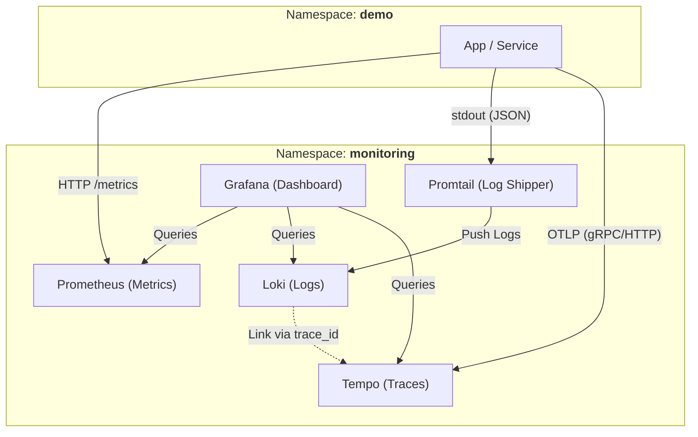

# Observability Stack Flow Diagram

This diagram visualizes how metrics, logs, and traces flow within the `obs-demo-stack`.

## Flow Explanation
-   **Metrics**: Applications expose endpoints (usually `/metrics`) which are scraped by **Prometheus** via **ServiceMonitors**.
-   **Logs**: Applications write logs to `stdout`. **Promtail** runs as a DaemonSet, collects these logs, and pushes them to **Loki**. Logs are formatted as JSON where possible to include a `trace_id`.
-   **Traces**: Applications use the **OpenTelemetry (OTLP)** SDK to send distributed traces directly to **Tempo**.
-   **Correlation**: In **Grafana**, logs in Loki that contain a `trace_id` are automatically linked to their corresponding traces in Tempo, providing a seamless "Logs to Traces" experience.
-   **Management**: **ArgoCD** manages the lifecycle of both the applications and the observability infrastructure.
